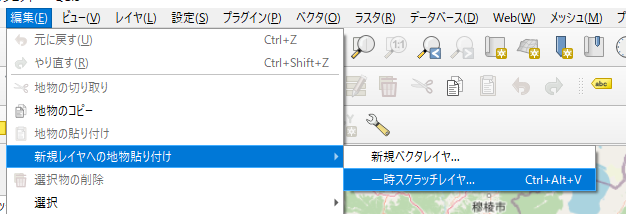

<!--
.. title: [QGIS] コピーしたフィーチャを新しいスクラッチレイヤに貼り付ける
.. slug: create-scratch-layer-from-selection
.. date: 2021-09-20 15:29:33 UTC+09:00
.. tags: GIS, QGIS
.. category: 
.. link: 
.. description: 
.. type: text
-->

# はじめに

既存のレイヤの特定のフィーチャをコピーして新しいレイヤを作りたい場合がありますよね。

そんな場面に役立つ Tips です。

[TOC]

<!-- TEASER_END -->

# 手順

1. フィーチャを選択

    属性値でも、空間的関係でもいいので目的のフィーチャを選択します。

2. コピーする

    [編集] --> [地物のコピー] で選択したフィーチャをコピーします。  
    

3. 新しいレイヤに貼り付ける

    [編集] --> [新規レイヤへの地物貼り付け] --> [一時スクラッチレイヤ] で新しいスクラッチレイヤを作って貼り付けます。

    レイヤ名の入力ダイアログが出るので適当に名前をつければ完成

    ちなみに `Ctrl + Alt + v` (Macは`Ctrl + Command + v`かな？) でも新規レイヤに貼り付けができます。

    

どうでもいいけど、地物とかフィーチャって独特な言い回しだよねー。  
当たり前のように使って、？？？な反応を受けることが多い。
