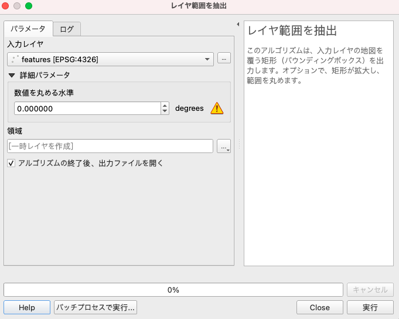

<!--
.. title: QGISでレイヤのエクステントをポリゴンで出力する
.. slug: extract-layer-extent
.. date: 2021-10-03 23:44:25 UTC+09:00
.. tags: GIS, QGIS
.. category:
.. link:
.. description:
.. type: text
-->

# レイヤの範囲 (バウンディングボックス) をポリゴンで出力したい

そんな時は「レイヤ範囲のを抽出(Extract layer extent)」ツールを使おう

これ

[公式ヘルプ](https://docs.qgis.org/testing/en/docs/user_manual/processing_algs/qgis/layertools.html#egispolygonfromlayerextent)
