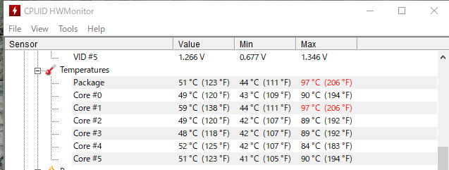
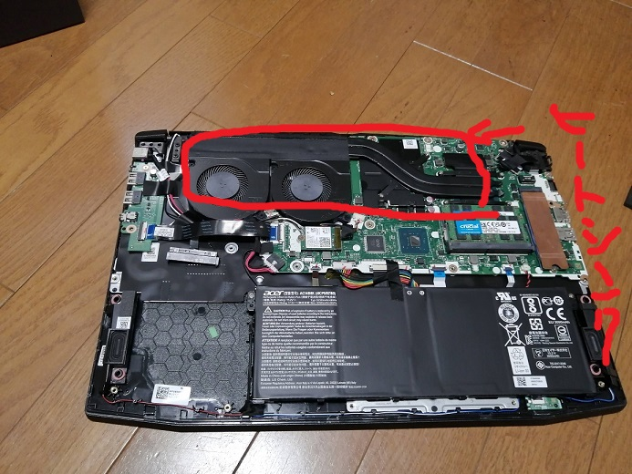
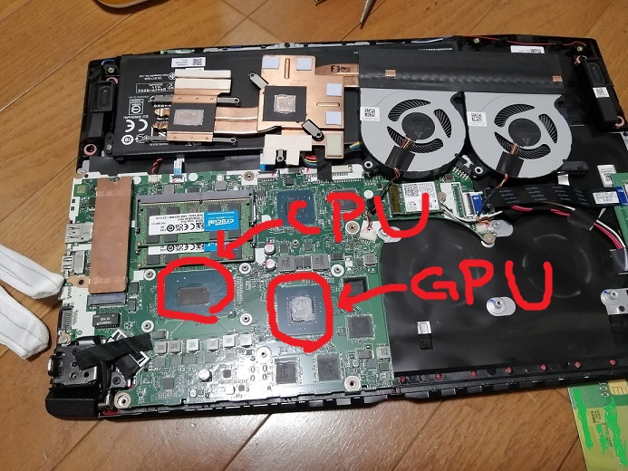
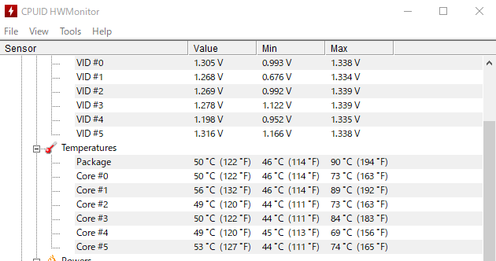

<!--
.. title: ノートPCのCPUグリスを塗りなおしてみた
.. slug: cpu-grease-laptop
.. date: 2021-09-26 02:10:53 UTC+09:00
.. tags: hardware,cpu
.. category: 
.. link: 
.. description: 
.. type: text
-->

# ファンがうるせぇ

というわけで、メインで使用している Acer Nitro 5 のファンがうるさい。

まぁゲーミングノートはどうしても熱の問題がついてまわりますね。

気休めかもしれないけど、新古の展示品で売られてたものを購入して 1 年ちょっとたつので CPU グリスも変え時かなと。

<!-- TEASER_END -->

# グリス変えてみる

## 交換前の CPU 温度

[base mark web 3.0](https://web.basemark.com/) で負荷かけた時の CPU 温度は、最高で 97 度。  
ちょっと高いよねー。100 度超えるとサーマルスロットリング起きると思うので。

## グリスを交換

今回は安定の MX-4 を塗っていく。

<iframe style="width:120px;height:240px;" marginwidth="0" marginheight="0" scrolling="no" frameborder="0" src="https://rcm-fe.amazon-adsystem.com/e/cm?ref=qf_sp_asin_til&t=peschangel-22&m=amazon&o=9&p=8&l=as1&IS2=1&detail=1&asins=B084VQ2XTQ&linkId=f7e0016b404c41680b4efb14daf9f0a2&bc1=000000&amp;lt1=_blank&fc1=333333&lc1=0066c0&bg1=ffffff&f=ifr">
</iframe>

背面のネジ外して裏蓋外すとこんな感じになってます。上部のファンから右に出てる管みたいなのがヒートシンク。

ヒートシンクとファンを外すとこんな感じに CPU と GPU にアクセスできる。

カピカピの既存のグリスを以下のようなグリス落としや、クリーナーで綺麗にして新しいのを塗りましたとさ。

<iframe style="width:120px;height:240px;" marginwidth="0" marginheight="0" scrolling="no" frameborder="0" src="https://rcm-fe.amazon-adsystem.com/e/cm?ref=tf_til&t=peschangel-22&m=amazon&o=9&p=8&l=as1&IS2=1&detail=1&asins=B07XDS97NJ&linkId=0452ca67689f93bc6816f6344ffb9b31&bc1=000000&amp;lt1=_blank&fc1=333333&lc1=0066c0&bg1=ffffff&f=ifr">
</iframe>
<iframe style="width:120px;height:240px;" marginwidth="0" marginheight="0" scrolling="no" frameborder="0" src="https://rcm-fe.amazon-adsystem.com/e/cm?ref=tf_til&t=peschangel-22&m=amazon&o=9&p=8&l=as1&IS2=1&detail=1&asins=B00430EX2E&linkId=64bb7f6b9210e029cbbb5f6c1711a351&bc1=000000&amp;lt1=_blank&fc1=333333&lc1=0066c0&bg1=ffffff&f=ifr">
</iframe>

## 交換後の CPU 温度

約 10 度ぐらい下がったし、ファンが回転し始めると気持ち温度が下がるのが早い気がする。

ファンも少し静かになった！きがする！

# まとめ

MX-4 で CPU グリスを塗り替えました。

長年使ってるラップトップも CPU グリス変えるだけで少し快適になるかも？

(ちなみにグリスのおかげなのか、塗り替え時にファンやら何やらを掃除したおかげなのかは定かではない)
